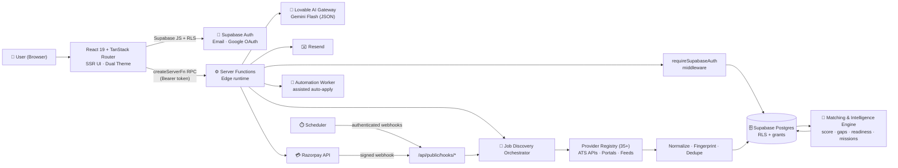
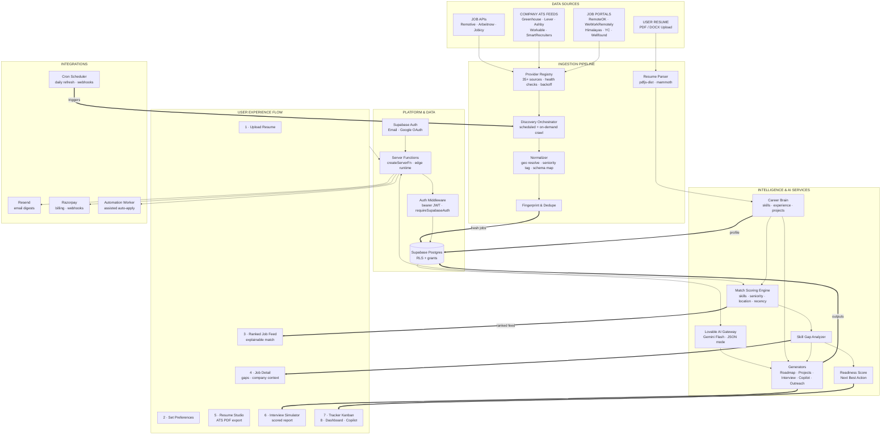

# 🚀 CareerOS

> An AI-powered Career Operating System — it reads your resume, discovers real jobs from 35+ live sources, scores how well you match, and turns the gaps into a concrete plan.

<p align="left">
  
  
  
  
  
  
  
</p>

**[Overview](#-project-overview) • [Features](#-key-features) • [Tech Stack](#-tech-stack) • [Architecture](#-system-architecture) • [Setup](#-installation--setup) • [Environment](#-environment-variables) • [Security](#-security)**

🌐 Live: **https://careerosai.site**

---

## 🎯 Project Overview

Job seekers waste most of their time on the wrong problems: re-writing the same resume, scrolling job boards full of stale or irrelevant listings, and guessing why they never hear back.

**CareerOS** replaces that guesswork with one connected system:

1. **Upload a resume** → it is parsed into a structured *Career Brain* (skills, experience, projects, education).
2. **Jobs are discovered live** from official APIs, company ATS feeds and job portals — not a static seeded table.
3. **Every job is scored** against your profile (skills, seniority, location, recency, salary) with an explainable breakdown.
4. **Gaps become actions** — skill-gap analysis, a phased career roadmap, project suggestions, and learning items.
5. **You prepare and apply** — tailored resume versions in the Resume Studio, an AI interview simulator with a scored report, recruiter outreach drafts, and a Kanban application tracker.

**Useful for:** students and early-career engineers (India + remote focused), career switchers, and anyone who wants a measurable, data-backed job search instead of a spreadsheet.

---

## ✨ Key Features

- 📄 **Resume Parsing & Career Brain** — PDF/DOCX resumes are parsed client-side and normalized into a structured profile that powers every other module.
- 🔎 **Live Job Discovery (35+ providers)** — Aggregates roles from official APIs (Greenhouse, Lever, Ashby, Workable, SmartRecruiters, Remotive, Arbeitnow, Jobicy, Himalayas, WeWorkRemotely, RemoteOK, YC and more) with de-duplication via job fingerprints.
- 🎯 **Explainable Match Scoring** — Seniority-aware, location-aware scoring with a per-category breakdown ("why you match / what's missing") instead of an opaque percentage.
- 🇮🇳 **Geo & Seniority Normalization** — Canonical country/city resolution plus entry-level detection so India and Remote–India roles surface correctly.
- 🧠 **Career Readiness Score** — A weighted score across profile completeness, resume quality, skills, projects, market alignment and activity, with the highest-impact next action.
- ✅ **Next Best Action & Daily Missions** — Ranks stale applications, high-match jobs, top skill gaps and upcoming interviews; missions complete only from real activity.
- 🗺️ **Career Roadmap** — AI-generated phased roadmap (skills → projects → certifications → prep) with status tracking and an interactive career graph.
- 📊 **Skill Gap Analysis** — Deterministic set-diff between your skills and job requirements, with "learn it / add to roadmap / build a project" actions.
- 📝 **Resume Studio** — Multiple ATS-friendly templates, job-specific versions, and a professional selectable-text A4 PDF export.
- 🗂️ **Application Tracker** — Kanban pipeline with follow-up alerts for applications sitting without a response.
- 🎤 **AI Interview Simulator** — HR / technical / behavioural / system-design sessions with scored dimensions, strengths, improvement areas and a downloadable PDF report.
- 💬 **Career Copilot Chat** — Context-aware assistant that knows your readiness, roadmap, gaps and pipeline.
- ✉️ **Recruiter Outreach** — Generates tailored outreach and follow-up messages from job + profile context.
- 🔔 **Notifications & Email Digests** — In-app notification center plus transactional/weekly summary email via Resend.
- 📈 **Analytics & Salary Insights** — Real funnel metrics (applications → responses → interviews → offers) and salary aggregates from matched roles.
- 🛡️ **Admin Panel** — Allowlist-gated dashboards for users, jobs, providers, AI usage, billing, email health, plus branded PDF/XLSX exports.
- 💳 **Billing (Razorpay)** — Plan checkout with server-side signature verification, webhooks and invoice PDFs.
- 🎨 **Dual Theme System** — "Immersive" (dark, cinematic, default) and "Classic" (light editorial), sharing one token-driven design system.
- 🔐 **Auth & Row Level Security** — Supabase email/password + Google OAuth, with RLS policies and grants on every user table.

---

## 🧰 Tech Stack

| Category | Technologies |
| --- | --- |
| Framework | TanStack Start v1 (SSR + server functions), TanStack Router, React 19 |
| Language | TypeScript 5.8 |
| Build | Vite 8, Tailwind CSS v4 (`@tailwindcss/vite`) |
| UI | shadcn/ui + Radix UI primitives, Framer Motion, Lucide icons, Recharts, Sonner |
| Data layer | TanStack Query v5 |
| Backend | TanStack `createServerFn` RPC + file-based API routes (`src/routes/api/public/*`) |
| Database | Supabase Postgres with Row Level Security + SQL migrations |
| Auth | Supabase Auth (email/password, Google OAuth), bearer-token server middleware |
| AI | Lovable AI Gateway (Google Gemini Flash, JSON-mode responses) |
| Documents | pdfjs-dist + mammoth (parsing), jsPDF + jspdf-autotable (export), xlsx |
| Email | Resend + React Email templates |
| Payments | Razorpay (orders, checkout signature + webhook HMAC verification) |
| Automation | Node automation worker for assisted auto-apply sessions |
| Scheduling | Cron-authenticated public webhook routes (job discovery, match refresh, digests) |
| Runtime / Hosting | Edge worker runtime (Cloudflare workerd), custom domain over HTTPS |
| Tooling | ESLint 9, Prettier, Bun / npm |

---

## 🏗️ System Architecture



**Request flow in one line:** the browser calls a typed server function with a Supabase bearer token → middleware verifies the JWT and creates a per-user Supabase client → business logic in `*.server.ts` reads/writes Postgres under RLS and optionally calls the AI gateway → typed JSON returns to TanStack Query.

### End-to-End Architecture (Data Sources → AI Services → UI Flow)

The layered view below traces a single journey through the whole system: raw job sources and the user's resume enter on the left, are normalized and scored by the intelligence layer, persist under RLS in Postgres, and surface in each product surface of the UI.



**Layer responsibilities**

| Layer | Responsibility |
| --- | --- |
| 1 · Data Sources | Official job APIs, company ATS feeds, job portals, and the user's uploaded resume |
| 2 · Ingestion | Provider registry with health/backoff, discovery orchestrator, normalization, geo + seniority tagging, fingerprint dedupe, resume parsing |
| 3 · Intelligence & AI | Career Brain, match scoring, skill-gap analysis, readiness score, and Lovable AI Gateway (Gemini Flash) for roadmap, projects, interview simulation, copilot and outreach |
| 4 · Platform & Data | `createServerFn` RPC on the edge runtime, bearer-JWT auth middleware, Supabase Postgres with RLS + grants, Supabase Auth, authenticated public webhooks |
| 5 · Experience | Upload → preferences → ranked job feed → job detail → resume studio → interview simulator → tracker → dashboard/analytics |
| 6 · Integrations | Resend email, Razorpay billing, automation worker for assisted auto-apply, scheduler for cron routes |


---

## 📁 Project Structure

```text
careeros/
├── src/
│   ├── routes/                     # File-based routing (TanStack Router)
│   │   ├── __root.tsx              # App shell, head metadata, providers
│   │   ├── index.tsx               # Marketing homepage (dual theme)
│   │   ├── auth.tsx                # Sign in / sign up
│   │   ├── _authenticated/         # Gated workspace (dashboard, jobs, resumes,
│   │   │                           # roadmap, interview, tracker, analytics, admin…)
│   │   └── api/public/hooks/       # Public webhooks: cron + payment callbacks
│   ├── lib/
│   │   ├── *.functions.ts          # Server-function RPC boundary (thin wrappers)
│   │   ├── jobs/                   # Discovery, providers, scoring, geo, normalize
│   │   ├── intelligence/           # Readiness, gaps, roadmap, missions, simulator
│   │   ├── resume-*/ , career-*/   # Resume parsing, Career Brain, copilot
│   │   ├── billing/ , email/       # Razorpay + Resend server helpers
│   │   └── ai-gateway.server.ts    # Lovable AI Gateway client
│   ├── features/                   # Feature UIs (jobs, resume-studio, admin, …)
│   ├── components/                 # Design system + shared UI primitives
│   ├── integrations/supabase/      # Generated clients, auth middleware, types
│   └── styles.css                  # Tailwind v4 theme tokens (both themes)
├── automation-worker/              # Standalone Node worker for auto-apply
├── supabase/                       # Project config & migrations
├── public/                         # Static assets, manifest, robots.txt
├── .env.example                    # Safe environment template
└── README.md
```

| Folder | Purpose |
| --- | --- |
| `src/routes` | Every URL in the app; `_authenticated/` is guarded by a route-level auth gate |
| `src/lib/*.functions.ts` | The only place `createServerFn` is declared — thin RPC wrappers |
| `src/lib/**/*.server.ts` | Server-only business logic (never imported by client components) |
| `src/lib/jobs/providers` | One file per job source, all implementing a single `JobProvider` contract |
| `src/lib/intelligence` | Scoring, gap analysis, roadmap, missions and interview logic |
| `src/integrations/supabase` | Auto-generated clients and types — do not hand-edit |

---

## ✅ Prerequisites

- **Git**
- **Node.js 20+** (or **Bun 1.1+**, which the project is optimized for)
- **npm** / **bun** package manager
- A **Supabase project** (Postgres + Auth) — URL, publishable key, service role key
- A **Lovable AI Gateway key** for AI features
- *Optional:* **Resend** account (email), **Razorpay** test keys (billing)

> Docker is not required — the app runs on Vite locally and deploys to an edge worker runtime.

---

## ⚙️ Installation & Setup

```bash
# 1. Clone
git clone https://github.com/<your-username>/<your-repo>.git
cd <your-repo>

# 2. Install dependencies
bun install
# or: npm install

# 3. Configure environment
cp .env.example .env
# then edit .env and fill in your own values

# 4. Start the dev server (http://localhost:8080)
bun run dev
# or: npm run dev
```

Apply the database schema to your own Supabase project by running the SQL migrations in `supabase/` against it (SQL editor or Supabase CLI) before first use.

---

## 🔑 Environment Variables

Create a `.env` from the template:

```bash
cp .env.example .env
```

| Variable | Description | Required |
| --- | --- | --- |
| `VITE_SUPABASE_URL` | Supabase project URL (browser) | Yes |
| `VITE_SUPABASE_PUBLISHABLE_KEY` | Supabase publishable key (browser-safe) | Yes |
| `VITE_SUPABASE_PROJECT_ID` | Supabase project ref | Yes |
| `SUPABASE_URL` | Same URL for SSR / server functions | Yes |
| `SUPABASE_PUBLISHABLE_KEY` | Same publishable key, server side | Yes |
| `SUPABASE_SERVICE_ROLE_KEY` | Privileged key for admin tasks — **server only** | Yes |
| `LOVABLE_API_KEY` | Lovable AI Gateway key for all AI features | Yes |
| `APP_URL` | Public base URL used in emails and links | Yes |
| `RESEND_API_KEY` | Resend API key for transactional email | For email |
| `RESEND_FROM_EMAIL` / `RESEND_FROM_NAME` / `RESEND_REPLY_TO` | Sender identity | For email |
| `INVOICE_FROM_EMAIL` | Sender for invoice emails | For billing email |
| `LOVABLE_SEND_URL` | Managed email send endpoint | Optional |
| `RAZORPAY_KEY_ID` / `RAZORPAY_KEY_SECRET` | Razorpay API credentials | For billing |
| `RAZORPAY_WEBHOOK_SECRET` | Shared secret used to verify webhook HMAC | For billing |
| `CRON_JOBS_SECRET` | Bearer secret for scheduled webhook routes | For cron |
| `LOVABLE_CRON_SECRET` / `LOVABLE_CRON_SECRET_PREVIOUS` | Managed cron secrets (supports rotation) | For cron |
| `AUTO_APPLY_WORKER_URL` / `AUTO_APPLY_WORKER_SECRET` | Automation worker endpoint + shared secret | For auto-apply |

Only `VITE_*` variables reach the browser. Everything else is read **inside server-function handlers** and never bundled into client code. No real values are stored in this repository.

---

## ▶️ Running the Application

**Development**

```bash
bun run dev          # Vite dev server on http://localhost:8080
```

**Production build & preview**

```bash
bun run build        # production build (edge worker output)
bun run preview      # serve the production build locally
```

**Quality checks**

```bash
bun run lint         # ESLint
bun run format       # Prettier
```

**Automation worker (optional, separate process)**

```bash
cd automation-worker
npm install
npm start
```

---

## 🧭 Usage Guide

1. **Open the app** and pick a theme (Immersive dark is the default).
2. **Create an account** with email/password or Google sign-in.
3. **Upload your resume** (PDF/DOCX) — it is parsed into your Career Brain.
4. **Set job preferences** — target roles, locations (India / Remote), seniority, salary.
5. **Browse the live job feed** — sorted by match score, with freshness indicators and an explainable breakdown per job.
6. **Open a job** to see match intelligence, missing skills, and company context; save it or send it to the tracker.
7. **Fix the gaps** — add skills to your roadmap, start a suggested project, or open a learning item.
8. **Tailor a resume** in Resume Studio and export a clean, ATS-friendly A4 PDF.
9. **Practice interviews** in the simulator and download the scored report.
10. **Track applications** on the Kanban board, act on follow-up alerts, and review analytics as your pipeline grows.

Empty states guide you when a module has no real data yet — nothing is faked.

---

## 🔌 API Endpoints

Application logic is exposed as typed server functions (RPC), not a public REST surface. The only externally callable HTTP endpoints are webhooks under `/api/public/*`, and each one authenticates its caller inside the handler:

| Method | Endpoint | Description | Auth |
| --- | --- | --- | --- |
| `POST` | `/api/public/hooks/discover-jobs` | Runs the job discovery pipeline across enabled providers | Cron bearer secret |
| `POST` | `/api/public/hooks/refresh-matches` | Recomputes match scores for active users | Cron bearer secret |
| `POST` | `/api/public/hooks/weekly-summary` | Sends the weekly digest email | Cron bearer secret |
| `POST` | `/api/public/hooks/razorpay-webhook` | Payment lifecycle events | Razorpay HMAC signature |
| `POST` | `/api/public/hooks/auto-apply-events` | Progress events from the automation worker | Worker shared secret |
| `GET` | `/api/public/hooks/email-diagnostic` | Email delivery diagnostics | Shared secret |
| `GET` | `/sitemap.xml` | Generated sitemap | Public |

---

## 🔒 Security

- Environment variables hold **all** sensitive configuration; no credentials are hardcoded anywhere in the codebase.
- `.env` and every secret-bearing pattern (`*.pem`, `*.key`, `*.crt`, `service-account*.json`, `.dev.vars`) are excluded via `.gitignore`.
- `.env.example` ships **placeholders only** — never real values.
- Secrets are read **inside server-function handlers**; only `VITE_*` publishable values are exposed to the browser.
- The service role key is used exclusively in server-only modules and never reaches client bundles.
- Every user table has **Row Level Security** enabled with explicit policies and grants; user data is scoped to `auth.uid()`.
- Protected server functions require a verified Supabase bearer JWT (`requireSupabaseAuth`).
- Public webhooks verify the caller before processing: HMAC signature checks (Razorpay) with `timingSafeEqual`, and bearer secrets for cron/worker routes.
- Admin surfaces are gated by a server-side allowlist — never client-side flags or local storage.
- For CI/CD, store credentials as **GitHub Actions secrets** and reference them as `${{ secrets.SECRET_NAME }}` — never inline in workflow files.

> ⚠️ If a credential was ever committed to Git history, deleting it in a later commit is **not** enough — rotate/revoke it at the provider.

---

## 🚀 Deployment

The app is deployed to an **edge worker runtime** behind a custom domain with HTTPS:

- Production: **https://careerosai.site**

Deployment steps:

1. Set every required environment variable in the hosting environment's secret store (not in files).
2. Build with `bun run build` (or your platform's build command).
3. Point the custom domain at the deployment and confirm HTTPS.
4. Configure the scheduler to call the `/api/public/hooks/*` routes with the cron bearer secret.
5. Register the Razorpay webhook URL and save the same webhook secret on both sides.

Because the server runs in a worker runtime, avoid Node-only native dependencies (`child_process`, `sharp`, native addons) in server code.

---

## 🗺️ Future Improvements

- Broader provider coverage and smarter provider health/backoff handling
- Voice-based interview simulation on top of the existing session architecture
- Automated test suite (unit tests for scoring/geo, E2E for core flows)
- Deeper analytics: cohort benchmarking and per-resume performance attribution
- Background job queue for heavier AI batches instead of on-demand calls
- Observability: structured logging, error tracking and provider dashboards
- Containerized local stack and CI pipeline (lint → typecheck → build) via GitHub Actions

---

## 🤝 Contributing

1. Fork the repository
2. Create a feature branch — `git checkout -b feature/your-feature`
3. Make your changes (keep server-only logic in `*.server.ts`)
4. Verify locally — `bun run lint` and `bun run build`
5. Commit and push, then open a Pull Request describing the change

Please never commit `.env` files, keys, or generated Supabase client files.

---

## 📄 License

No license file is currently included in this repository, so all rights are reserved by the authors. Add a `LICENSE` file (e.g. MIT) if you intend to make the project open source.

---

## 🧾 Pre-Push Security Checklist

- [x] `.env` and `.env.*` (except `.env.example`) are git-ignored
- [x] No API keys, tokens or passwords in tracked source files
- [x] No AWS access keys or database credentials in the repository
- [x] No `.pem`, `.key`, or SSH private keys included
- [x] No JWT or webhook secrets hardcoded
- [x] `.env.example` contains placeholders only
- [x] `.gitignore` covers env files, keys, certificates and build caches
- [x] Secrets read from the server runtime only; browser sees `VITE_*` publishable values
- [ ] CI/CD workflows (when added) use `${{ secrets.* }}` — never literals
- [ ] Rotate any credential that was previously committed to Git history

---

<p align="center"><sub>Built with TanStack Start, Supabase and the Lovable AI Gateway.</sub></p>
